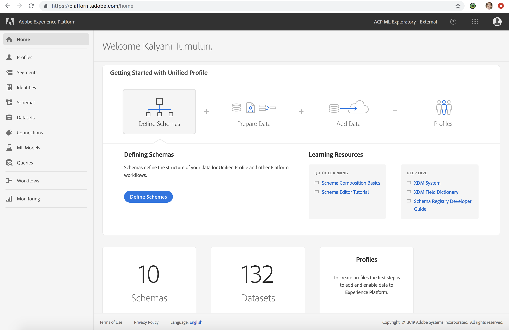

# _retail_ Sample App

Sample PySpark Recipe using the retail data.

# Workflow
 
1. The recipe loads the dataset.
2. Feature engineering is done on the data so that the data can be used for machine learning training. 
3. The feature pipeline defines the stages with the Gradient Boosting Regressor as the chosen model.
4. This pipeline is used to fit the training data and the trained model is created. 
5. The model is transformed with the scoring dataset. 
5. Interesting columns of the output are then selected and saved back to the platform with the associated data.

# Prerequisites

To run the recipe in any org, we would need the schema of the dataset(if not uploaded previously),the input dataset, output schema and empty output dataset uploaded to the platform UI.
If all of these are previously uploaded in your org you can directly go to the section `Steps to run training and scoring jobs`
Make sure that the name of the schema and the dataset ids match the ones being supplied in `Sample config json`

### Upload Schema

Upload the schema of the retail data (input data) from: 
`https://github.com/adobe/experience-platform-dsw-reference/blob/master/datasets/retail/DSWRetailSales.xdm.json`


        curl -X POST \
             https://platform.adobe.io/data/foundation/catalog/xdms/_customer/DSWRetailSales \
             -H 'Authorization: Bearer {token} \ - Get the token from cookies of the UI 
             -H 'Content-Type: application/json' \
             -H 'cache-control: no-cache' \
             -H 'x-api-key: acp_machineLearning_customer' \
             -H 'x-gw-ims-org-id: 20656D0F5B9975B20A495E23@AdobeOrg' \
             -d '{
                   "title": "DSWRetailSales",
                   "description": "string",
                   "type": "object",
                   "properties": {
                     "date": {
                       "id": "date",
                       "type": "string"
                     },
                     "store": {
                       "id": "store",
                       "type": "integer"
                     },
                     "storeType": {
                       "id": "storeType",
                       "type": "string"
                     },
                     "weeklySales": {
                       "id": "weeklySales",
                       "type": "number"
                     },
                     "storeSize": {
                       "id": "storeSize",
                       "type": "integer"
                     },
                     "temperature": {
                       "id": "temperature",
                       "type": "number"
                     },
                     "regionalFuelPrice": {
                       "id": "regionalFuelPrice",
                       "type": "number"
                     },
                     "markdown": {
                       "id": "markdown",
                       "type": "number"
                     },
                     "cpi": {
                       "id": "cpi",
                       "type": "number"
                     },
                     "unemployment": {
                       "id": "unemployment",
                       "type": "number"
                     },
                     "isHoliday": {
                       "id": "isHoliday",
                       "type": "boolean"
                     }
                   }
             }
### Upload Dataset from UI             

Upload the parquet file from here:
`https://github.com/adobe/experience-platform-dsw-reference/blob/master/datasets/retail/DSWRetailSales.parquet`

Create a dataset with "DSWRetailSales" schema and the parquet file as the source.
Please look at the `Video to create dataset and upload parquet file` to platform UI.

### Video to create dataset and upload parquet file

[](https://youtu.be/pRyN-Xb2cyo)

### Upload output schema 

Upload the output schema (schema should have "prediction:Number, store:Integer, date:String"). 
Please refer to the curl command to upload schema to platform UI and replace the body with:

```
{
    "title: "DSWRetailSalesOutput",
    "description: "string",
    "type: "object",
    "properties" : {
        "date": {
            "id": "date",
            "type": "String"
        },
        "store": {
            "id": "store",
            "type": "Integer"
        },
        "prediction": {
            "id": "prediction",
            "type": "Number"
        }
    }                
}
```
Also replace the title of the schema in the url to `https://platform.adobe.io/data/foundation/catalog/xdms/_customer/DSWRetailSalesOutput`
Create an empty dataset with this schema. 
Please look at the video `Video to create dataset and upload parquet file`. 
(Do not have to upload any parquet for this because we want an empty dataset)
Get this datasetId and plug it in pipelineservice.json. For eg: it is referenced as scoredDatasetId in the sample json. All the prerequisites are complete and you can now proceed to running some training and scoring jobs. 


# Steps to run training and scoring jobs

git clone this repository from `https://github.com/adobe/experience-platform-dsw-reference`


cd to recipes/pyspark and run `build.sh` 

```
sh ./build.sh
```

This generates an egg and is saved in the dist directory of the project. 
Use this egg and go to platform UI and run training and scoring. 
Please look at the video `Video for Training, Scoring and Saving data`

### Video for Training, Scoring and Saving data
[](https://youtu.be/4alPIS-3mMM)

# Sample Config json
```
[
    {
        "name": "train",
        "parameters": [
            {
                "key": "learning_rate",
                "value": "0.1"
            },
            {
                "key": "n_estimators",
                "value": "100"
            },
            {
                "key": "max_depth",
                "value": "3"
            },
            {
                "key": "ACP_DSW_INPUT_FEATURES",
                "value": "date,store,storeType,storeSize,temperature,regionalFuelPrice,markdown,cpi,unemployment,isHoliday"
            },
            {
                "key": "apiKey",
                "value": "acp_machineLearning_customer"
            },
            {
                "key": "ACP_DSW_TARGET_FEATURES",
                "value": "weeklySales"
            },
            {
                "key": "ACP_DSW_FEATURE_UPDATE_SUPPORT",
                "value": false
            },

            {
                "key": "ACP_DSW_TRAINING_XDM_SCHEMA",
                "value": "/_customer/default/DSWRetailSales"
            }
        ]
    },
    {
        "name": "score",
        "parameters": [
            {
                "key": "apiKey",
                "value": "acp_machineLearning_customer"
            },
            {
                "key": "scoredDataSetId",
                "value": "5c1bd652cf294b00001b3650"
            }
        ]
    }
]
```
